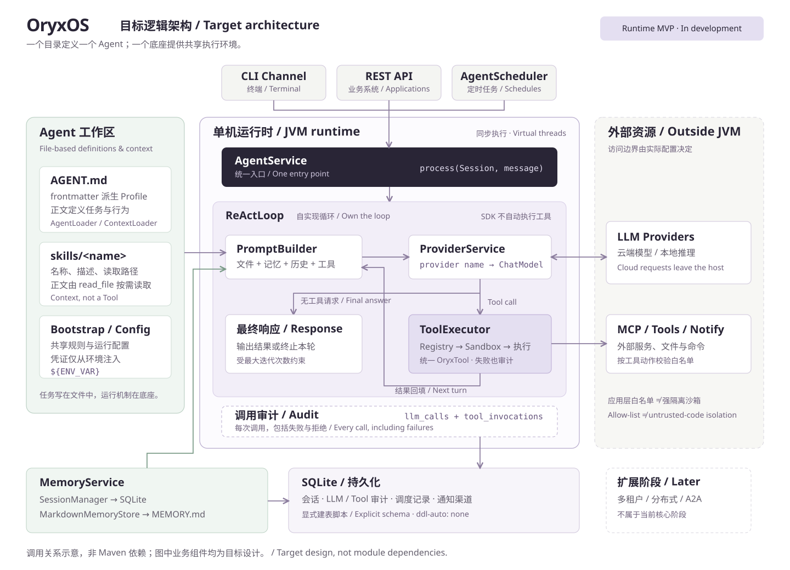

<div align="center">


**Java 原生的企业级 Agent 操作系统（Agent Harness OS）**

一个目录定义一个 Agent，一个底座运行一群 Agent。私有部署，数据不出域。

[](#许可证)
[](#环境要求)
[](#技术栈)
[](#项目状态)

[官网](https://oryxos.hifane.com) · [简介](#简介) · [特性](#核心特性) · [快速开始](#快速开始) · [架构](#架构) · [路线图](#路线图) · [文档](#文档) · [参与贡献](#参与贡献)

</div>

---

## 项目状态

> [!WARNING]
> OryxOS 处于**早期开发阶段**（阶段一：单机运行时内核）。目前仓库中是完整的设计文档，代码正在按 [路线图](#路线图) 逐步实现。下文的命令和接口是 1.0 的目标形态，API 在正式发布前可能变化，请勿用于生产环境。

## 简介

每家公司都有该交给 Agent 的活，但大多数 Agent 还停在 demo，卡在四道门槛上：

- **定义 Agent 要写代码**：最懂业务的人反而做不了；
- **云平台要把数据拿走**：合规过不去；
- **执行是黑盒**：没有审计、没有白名单，企业不敢上生产；
- **跑一个容易，跑一群难**：没有人提供"一群 Agent 的操作系统"这一层。

**OryxOS** 就是这一层。它装在企业自己的 K8s、虚拟机或物理机上，为运维助手、客服助手、知识助手等各类业务 Agent 提供统一的模型接入、推理循环、记忆、工具调用、沙箱与审计能力。业务方只需**写一个目录、配几个工具**，不需要写 Agent 后端代码。

```
自然语言(AGENT.md) + Memory + Tool + MCP + Skill + Notify = 一个 Agent
```

> runtime 让一个 Agent 跑起来，Agent OS 让一群 Agent 在企业里被管起来。

### 为什么是 Java

OpenClaw（Node.js）和 Hermes Agent（Python）已经验证了 Agent OS 这套设计，但 Java 生态在这一层是空白。OryxOS 就是一个标准的 Spring Boot 应用：跟企业现有的 Java 服务直接对接，复用 Nacos / SkyWalking / Arthas / Prometheus 等运维工具链，走现有的 Java 代码审计与合规流程。

## 核心特性

- 🤖 **一个目录 = 一个 Agent**：`AGENT.md` 的 frontmatter 是运行配置，正文是任务指令，零代码定义 Agent，多个 Agent 同实例并存
- ☕ **Java 原生**：JDK 21 + Spring Boot 3.x，单个可执行 JAR 部署，virtual thread 支撑高并发
- 🧠 **自实现 ReAct 循环**：推理引擎不套外部 Agent 框架，循环行为完全可控
- 🔌 **拥抱开放标准**：工具走 [MCP](https://modelcontextprotocol.io)，Skill 兼容 agentskills.io 格式，Agent 目录借鉴 Anthropic Agent Skills 形态
- 🧩 **三档工具扩展**：零代码（Agent 目录 + 现成 MCP server）→ 轻代码（任意语言写 MCP server）→ 重代码（Java `@Tool` Bean）
- 💾 **跨对话记忆**：会话记忆 + 长期记忆（`MEMORY.md`，人可读、可 git 跟踪）
- 🛡️ **安全从第一天做进架构**：文件 / 命令 / 网络白名单沙箱，凭证不落地，每次 LLM 与 Tool 调用都落库审计
- ⏰ **定时自动运行**：Agent 可按 cron 到点自动执行并推送结果到企业 IM
- 🌐 **REST API 集成**：任何语言通过 HTTP 即可把 Agent 嵌入现有业务系统

## 快速开始

### 环境要求

- JDK 21+
- Maven 3.9+
- 一个 LLM API Key（DeepSeek、Kimi、通义等 OpenAI 兼容协议均可）
- 操作系统：Linux / macOS

### 构建

```bash
git clone https://github.com/hefrankeleyn/oryxos-practice.git && cd oryxos-practice
mvn clean package
alias oryxos="java -jar $(pwd)/oryxos-boot/target/oryxos.jar"
```

### 初始化工作区并创建第一个 Agent

```bash
export DEEPSEEK_API_KEY=sk-xxx

oryxos init                      # 在当前目录创建 .oryxos/ 工作区（幂等）
oryxos profile create weather    # 生成 .oryxos/agents/weather/AGENT.md 模板
```

编辑 `.oryxos/agents/weather/AGENT.md`：

```markdown
---
name: weather
description: 每天早上查询天气并给出穿搭建议
provider:
  name: deepseek
  model: deepseek-chat
tools:
  - http_get
  - notify
schedules:
  - key: morning
    cron: "0 0 8 * * *"
    zone: Asia/Shanghai
    message: 查询北京今天的天气并给出穿搭建议
settings:
  max_iterations: 10
---

你是一个贴心的天气助手。
1. 调用天气 API 获取北京今天的天气；
2. 根据温度、降水和风力给出简洁的穿搭建议；
3. 通过 notify 推送到 `team-lark` 通知渠道。
```

### 和 Agent 对话

```bash
oryxos chat --profile weather
> 查一下北京天气，今天穿什么？
```

### 以服务方式运行

```bash
oryxos serve   # 默认监听 8080，同时启动定时调度
```

```bash
curl -X POST http://localhost:8080/api/v1/agents/weather/invoke \
  -H 'Content-Type: application/json' \
  -d '{"message": "明天上海要带伞吗？"}'
```

## 架构

<p align="center">
  
</p>

三个触发入口（CLI、REST API、定时任务）汇入同一个 `AgentService`，ReAct 引擎不感知消息来源。Provider、Memory、Tool 三块能力供养引擎；Session 与审计数据落 SQLite，Agent 定义、Bootstrap、记忆等用户可维护的数据落文件系统。

### 工作区结构

```
.oryxos/
├── agents/            # 每个子目录 = 一个 Agent（AGENT.md + skills/ + scripts/）
├── skills/            # 公共 Skill 库（SKILL.md + 附属资源）
├── memory/MEMORY.md   # 长期记忆
├── sessions/          # 会话数据
├── logs/              # 结构化日志
├── mcp_servers.yaml   # MCP server 配置
├── AGENTS.md          # Bootstrap：项目级行为说明
├── SOUL.md            # Bootstrap：默认人格
├── USER.md            # Bootstrap：用户偏好
└── oryxos.db          # SQLite（会话、审计、定时任务）
```

### 模块

| 模块 | 职责 |
|---|---|
| `oryxos-core` | 核心抽象与引擎：`ReActLoop`、`PromptBuilder`、`ToolExecutor`、`AgentService`、`AgentLoader`、`ContextLoader`、`AgentScheduler` |
| `oryxos-provider` | LLM Provider 抽象，基于 Spring AI Alibaba，provider name 显式映射 |
| `oryxos-memory` | `MemoryService` 统一门面、长期记忆存储、`save_memory` / `recall_memory` |
| `oryxos-tool` | 内置工具、MCP Client、`ToolRegistry`、`Sandbox`、通知推送 |
| `oryxos-channel-cli` | CLI 对话渠道 |
| `oryxos-web` | REST API、统一异常处理、OpenAPI 文档 |
| `oryxos-storage` | SQLite 持久化：会话与审计表 |
| `oryxos-cli` | Picocli 命令行入口、配置与密钥加载 |
| `oryxos-boot` | Spring Boot 启动与依赖聚合 |

## 使用指南

### 内置工具

| 工具 | 说明 |
|---|---|
| `read_file` / `write_file` / `list_dir` | 文件操作，受路径白名单约束 |
| `shell` | 执行白名单内的命令（参数数组直传，不经 shell 解释），带超时 |
| `http_get` / `http_post` | HTTP 请求，受域名白名单约束 |
| `save_memory` / `recall_memory` | 写入 / 关键词检索长期记忆 |
| `notify` | 推送消息到已注册的通知渠道（企业微信 / 飞书 / 钉钉 webhook 等） |

### 扩展工具的三种方式

| 方式 | 门槛 | 做法 |
|---|---|---|
| 零代码（推荐） | 最低 | 写 Agent 目录 + 在 `mcp_servers.yaml` 复用社区现成 MCP server |
| 轻代码 | 中 | 用任意语言写 MCP server 接入企业自有系统 |
| 重代码 | 高 | 用 Java `@Tool` 注解写 Spring Bean，进程内调用、性能最好 |

> 选择原则：能用方式一就不用方式二，能用方式二就不用方式三。

### 命令行

| 命令 | 说明 |
|---|---|
| `oryxos init` | 初始化工作区 |
| `oryxos status` | 查看配置与运行状态 |
| `oryxos chat [--profile <name>] [--message "..."]` | 交互对话 / 单条消息 |
| `oryxos serve` | 启动 REST API 服务 |
| `oryxos gateway` | 启动多渠道守护进程 |
| `oryxos profile list \| create \| show \| delete` | 管理 Agent |
| `oryxos provider list` | 列出已配置的 Provider |
| `oryxos tool list` | 列出已注册的工具 |
| `oryxos session list` | 列出会话历史 |

### REST API

| 方法 | 端点 | 说明 |
|---|---|---|
| `POST` | `/api/v1/sessions` | 创建会话 |
| `POST` | `/api/v1/sessions/{id}/messages` | 发送消息 |
| `GET` | `/api/v1/sessions/{id}` | 查询会话历史 |
| `DELETE` | `/api/v1/sessions/{id}` | 归档会话 |
| `POST` | `/api/v1/agents/{name}/invoke` | 无状态调用 Agent |
| `GET` | `/api/v1/profiles` | 列出 Agent |
| `GET` | `/api/v1/memory` | 查询长期记忆 |
| `GET` | `/api/v1/tools` | 列出可用工具 |
| `GET` | `/api/v1/health` | 健康检查 |
| `GET` | `/api/v1/info` | 运行信息 |

服务启动后可在 `/swagger-ui` 查看 OpenAPI 文档。

### 密钥配置

敏感信息不写入配置文件明文，统一用 `${ENV_VAR}` 占位，启动时从环境变量解析并校验：

```yaml
provider:
  api_key: ${DEEPSEEK_API_KEY}
```

## 安全模型

OryxOS 面向严监管企业，安全是地基而不是补丁：

- **最小权限**：每个 Agent 只能使用 frontmatter 中声明的工具
- **强制沙箱**：所有文件、命令、网络访问经 `Sandbox.enforce(...)` 校验，违规即终止并记录
- **全链路审计**：每次 LLM 调用写入 `llm_calls`，每次工具调用（含失败与沙箱拒绝）写入 `tool_invocations`
- **凭证不落地**：密钥经环境变量注入，扩展阶段对接 KMS / Vault

> [!NOTE]
> 核心阶段的沙箱是应用层白名单，用于防止模型误操作，不足以隔离蓄意恶意代码。请勿在当前版本中运行不可信代码或对外提供多租户服务；容器级 / microVM 级隔离在扩展阶段提供。

## 路线图

我们的开发理念是**慢就是快，克制且聚焦**：先把单机内核做扎实，再逐步生长出分布式能力。

- [ ] **阶段一：单机运行时内核**（进行中）
  - [ ] 对接 LLM（Provider 抽象，DeepSeek / Kimi 跑通）
  - [ ] ReAct 循环
  - [ ] Memory（会话 + 长期记忆）
  - [ ] Tool 体系（9 个内置工具、MCP Client、三档扩展、白名单沙箱）
  - [ ] Web Service（10 个核心端点）
  - [ ] 定时任务、SQLite 持久化与审计、12 个 CLI 命令
  - [ ] 验收 Demo：每日天气 / 每日科技日报 / 每日 GitHub 日报
  - [ ] 项目主页
- [ ] **阶段二：底座分布式**：实例无状态、状态外置、多副本高可用、水平扩展
- [ ] **阶段三：跨节点 Agent 协作**：Agent 通信底座，对接 A2A，跨节点发现与委托
- [ ] **横向能力**（伴随各阶段补齐）：IM 渠道（企业微信 / 飞书 / 钉钉）、Provider 故障转移、语义记忆、Tool Policy、容器级沙箱、SSO 与多租户 RBAC、完整审计与 SIEM 导出、Web 管理台、GraalVM Native Image

## 与相关项目的关系

| 项目类型 | 代表 | 与 OryxOS 的关系 |
|---|---|---|
| Agent OS | OpenClaw、Hermes Agent | **同类不同定位**：它们偏个人与小团队，OryxOS 定位严监管企业 |
| 编排平台 | Dify、Coze | **互补**：编排平台可作为应用层调用 OryxOS 的 API |
| Agent 框架 | Spring AI、LangChain4j | **复用**：OryxOS 的 LLM 调用层基于 Spring AI Alibaba 实现 |

一句话：框架给你材料让你自己盖房子，编排平台编排的是流程，OryxOS 给你一个拎包入住、可治理、可审计的 Agent 运行底座。

## 技术栈

JDK 21 · Spring Boot 3.x · Spring AI / Spring AI Alibaba · Spring MVC + Virtual Thread · SQLite + Spring Data JPA · MCP Java SDK · Picocli · SnakeYAML · Logback / SLF4J

## 文档

| 文档 | 内容 |
|---|---|
| [行业调研](docs/01-IndustryResearch.md) | Agent OS 定义、业界格局、Java 生态缺位与 OryxOS 定位 |
| [需求文档](docs/02-DemandAnalysis.md) | 功能与非功能需求、数据模型、验收标准 |
| [技术方案](docs/03-TechnicalSolution.md) | 关键技术决策、模块设计、关键流程 |
| [AI 编程指南](docs/04-AiProgrammingGuide.md) | 基于 Spec-Kit 的实施拆解 |
| [项目介绍](docs/06-oryxos.md) | 定位、愿景与设计原则 |

## 参与贡献

OryxOS 是 [oryx-labs](docs/05-oryx-labs.md) 社区的项目。oryx-labs 是一个由爱好驱动、**AI coding 驱动**的 AI 探索社区，欢迎任何形式的参与：提 issue、讨论设计、写代码、补文档。

1. Fork 本仓库并创建特性分支：`git checkout -b feat/your-feature`
2. 提交改动，commit message 遵循 [Conventional Commits](https://www.conventionalcommits.org/)
3. 确保 `mvn clean package` 通过
4. 提交 Pull Request

提交前请阅读 [CLAUDE.md](CLAUDE.md) 中的架构原则。其中几条是不可违背的，例如：ReAct 循环自实现、禁用 Spring AI 自动工具执行、审计 day one 落库、沙箱接口先行。

## 许可证

本项目基于 [Apache License 2.0](https://www.apache.org/licenses/LICENSE-2.0) 开源。

---

<div align="center">

长期目标：走进 Apache 基金会，成为 Apache 顶级项目。

Made with ❤️ by oryx-labs

</div>
